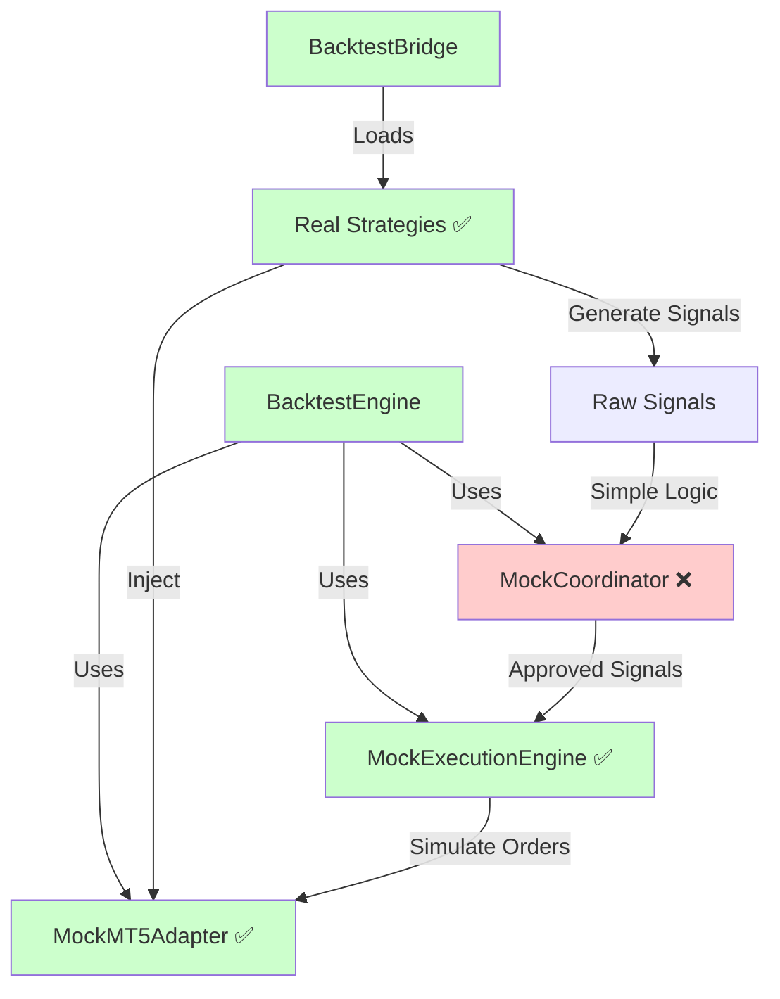
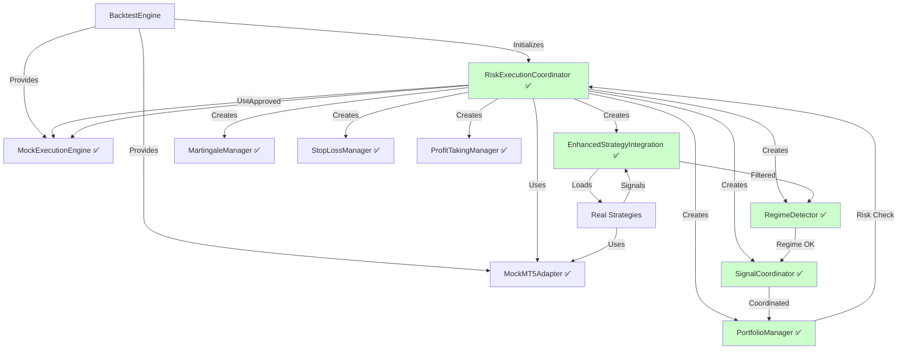

# Backtest Architecture: Current vs. Correct Flow

**Critical Finding:** Backtest mode uses **simplified mock logic** instead of **real production components**

---

## ❌ Current (Wrong) Architecture

### What's Currently Happening



### Current Flow (Simplified)

```
1. User runs backtest
   ↓
2. BacktestEngine creates:
   ✅ MockMT5Adapter (correct - simulates MT5 data)
   ❌ MockCoordinator (WRONG - simplified logic)
   ✅ MockExecutionEngine (correct - simulates order execution)
   
3. BacktestBridge loads:
   ✅ Real strategies from src/strategies/
   
4. For each bar:
   ✅ Real strategies generate signals
   ❌ MockCoordinator does basic checks
   ✅ MockExecutionEngine simulates execution
```

### What's Missing (NOT Used):

1. ❌ **RiskExecutionCoordinator** - The real orchestrator
2. ❌ **PortfolioManager** - Portfolio-level risk management
3. ❌ **RegimeDetector** - Market regime detection and filtering
4. ❌ **SignalCoordinator** - Cross-symbol signal coordination
5. ❌ **MartingaleManager** - Recovery system
6. ❌ **StopLossManager** - Dynamic stop loss management
7. ❌ **ProfitTakingManager** - Profit scaling strategies
8. ❌ **ConfigManager** - Full config system
9. ❌ **Multi-symbol coordination** - Real correlation checks
10. ❌ **Regime-based position sizing** - Adaptive risk

---

## ✅ Correct Architecture (What It Should Be)

### Proper Design



### Correct Flow

```
1. User runs backtest
   ↓
2. BacktestEngine creates MOCKS:
   ✅ MockMT5Adapter (data simulation)
   ✅ MockExecutionEngine (order simulation)
   
3. BacktestEngine creates REAL coordinator:
   ✅ RiskExecutionCoordinator(
       mt5_manager=MockMT5Adapter,
       execution_engine=MockExecutionEngine,
       config=master_config
   )
   
4. RiskExecutionCoordinator creates ALL real components:
   ✅ EnhancedStrategyIntegration
   ✅ PortfolioManager
   ✅ RegimeDetector
   ✅ SignalCoordinator
   ✅ MartingaleManager
   ✅ StopLossManager
   ✅ ProfitTakingManager
   
5. For each bar:
   ✅ Real strategies generate signals (same as live)
   ✅ RegimeDetector filters by market regime
   ✅ SignalCoordinator handles cross-symbol conflicts
   ✅ PortfolioManager checks portfolio-level risk
   ✅ RiskExecutionCoordinator does final validation
   ✅ MockExecutionEngine simulates the trade
```

---

## Key Principle: **Mock the Boundaries, Not the Logic**

### What Should Be Mocked

✅ **MockMT5Adapter** - Replaces MetaTrader 5 connection
- Provides historical data instead of live data
- Simulates current prices
- Tracks positions in memory instead of MT5

✅ **MockExecutionEngine** - Replaces broker execution
- Simulates order placement
- Applies slippage and commission
- No real money at risk

### What Should Be REAL

✅ **All Business Logic Components:**
- RiskExecutionCoordinator
- PortfolioManager  
- RegimeDetector
- SignalCoordinator
- MartingaleManager
- StopLossManager
- ProfitTakingManager
- EnhancedStrategyIntegration

### Why This Matters

**Current approach:**
```python
# Wrong - simplified logic
mock_coordinator.coordinate_signals(signals)
# → Basic position limit check only
```

**Correct approach:**
```python
# Right - exact same logic as live trading
risk_coordinator.process_signals(signals)
# → Full pipeline:
#    - Regime filtering
#    - Correlation checks
#    - Portfolio risk assessment
#    - Dynamic position sizing
#    - Martingale calculations
#    - Same decision-making as live!
```

---

## Current vs. Correct: Side-by-Side

| Component | Current | Should Be | Impact |
|-----------|---------|-----------|--------|
| **Data Source** | MockMT5Adapter | MockMT5Adapter | ✅ Correct |
| **Strategy Loading** | BacktestBridge → Real strategies | EnhancedStrategyIntegration → Real strategies | ⚠️ Different loader |
| **Regime Detection** | ❌ Not used | ✅ RegimeDetector | 🔴 Major difference |
| **Signal Coordination** | ❌ Nothing | ✅ SignalCoordinator | 🔴 Major difference |
| **Risk Coordination** | ❌ Simple MockCoordinator | ✅ RiskExecutionCoordinator | 🔴 **CRITICAL** |
| **Portfolio Management** | ❌ Not used | ✅ PortfolioManager | 🔴 Major difference |
| **Position Sizing** | ❌ Fixed lot size | ✅ Dynamic (Kelly, market regime) | 🔴 Major difference |
| **Stop Loss** | ❌ Fixed in signal | ✅ StopLossManager (trailing, ATR) | 🔴 Major difference |
| **Profit Taking** | ❌ Fixed TP | ✅ ProfitTakingManager (scaling) | 🔴 Major difference |
| **Martingale** | ❌ Not used | ✅ MartingaleManager | 🔴 Major difference |
| **Execution** | MockExecutionEngine | MockExecutionEngine | ✅ Correct |
| **Configuration** | Partial config | Full master_config + all sub-configs | ⚠️ Different |

**Result:** Backtest behavior is **fundamentally different** from live trading!

---

## Detailed Comparison: Signal Processing Pipeline

### ❌ Current (Wrong) Pipeline

```python
# main_system_run.py strategy_callback:

1. signals = bridge._generate_portfolio_signals()
   # ✅ Real strategies
   
2. coordinated = mock_coordinator.coordinate_signals(signals, positions)
   # ❌ Simplified logic:
   #    - Check if same direction exists
   #    - Check position limits
   #    - That's it!
   
3. mock_execution.execute_signal(approved_signal)
   # ✅ Simulate execution
```

**Missing Steps:**
- No regime filtering
- No correlation checks  
- No portfolio risk assessment
- No dynamic position sizing
- No trailing stop management
- No profit scaling
- No martingale recovery

### ✅ Correct (Production) Pipeline

```python
# How it works in Live/Paper mode via RiskExecutionCoordinator:

1. signals = strategy_integration._generate_portfolio_signals()
   # ✅ Real strategies
   
2. regime_filtered = regime_detector.filter_by_regime(signals)
   # Filter out signals against current market regime
   
3. coordinated = signal_coordinator.coordinate_signals(regime_filtered)
   # Handle cross-symbol signal conflicts
   # Check correlation limits
   
4. risk_assessed = portfolio_manager.assess_portfolio_risk(coordinated)
   # Check portfolio-level risk limits
   # Adjust position sizes dynamically
   # Apply Kelly criterion
   
5. final_signals = risk_coordinator.final_validation(risk_assessed)
   # Final coordinator checks
   # Apply regime-based risk multipliers
   
6. execution_engine.execute_signal(final_signal)
   # Execute with validated parameters
   
7. stop_loss_manager.monitor_positions()
   # Apply trailing stops, time-based stops
   
8. profit_taking_manager.scale_profits()
   # Partial profit taking at levels
   
9. martingale_manager.check_recovery()
   # Apply martingale if in drawdown
```

**This is what backtest SHOULD do!**

---

## Correct Implementation

### Phase 1: Modify BacktestEngine

**File:** `backtest/engine/backtest_engine.py`

**Current `_initialize_run()`:**
```python
def _initialize_run(self, symbols, timeframes, start_date, end_date):
    # Create mocks
    self.mock_mt5 = MockMT5Adapter(self.config, self.data_manager)
    self.mock_execution = MockExecutionEngine(self.mock_mt5, self.config)
    
    # ❌ WRONG: Create simplified mock coordinator
    self.mock_coordinator = MockCoordinator(self.config)
    
    self.event_loop = EventLoop(self.config)
```

**Correct `_initialize_run()`:**
```python
def _initialize_run(self, symbols, timeframes, start_date, end_date):
    # Create mocks for boundaries
    self.mock_mt5 = MockMT5Adapter(self.config, self.data_manager)
    self.mock_execution = MockExecutionEngine(self.mock_mt5, self.config)
    
    # ✅ CORRECT: Create REAL coordinator with mocked boundaries
    from src.core.coordinators.risk_execution_coordinator import RiskExecutionCoordinator
    
    self.coordinator = RiskExecutionCoordinator(
        config_path=None,  # Already have config
        config=self.config,
        mt5_manager=self.mock_mt5,        # ← Inject mock MT5
        execution_engine=self.mock_execution  # ← Inject mock execution
    )
    
    # RiskExecutionCoordinator will create ALL real components:
    # - EnhancedStrategyIntegration
    # - PortfolioManager
    # - RegimeDetector  
    # - SignalCoordinator
    # - MartingaleManager
    # - StopLossManager
    # - ProfitTakingManager
    
    self.event_loop = EventLoop(self.config)
```

### Phase 2: Modify Strategy Callback

**File:** `main_system_run.py`

**Current (Wrong):**
```python
def strategy_callback(event):
    # Initialize BacktestBridge on first call
    if strategy_integration is None:
        bridge = BacktestBridge(...)
        strategy_integration = bridge
    
    # Generate signals
    signals = strategy_integration._generate_portfolio_signals()
    
    # ❌ Use simplified mock coordinator
    coordinated = mock_coordinator.coordinate_signals(signals, positions)
    
    # Execute
    for signal in coordinated:
        if signal.approved:
            mock_execution.execute_signal(signal)
```

**Correct:**
```python
def strategy_callback(event):
    # Get coordinator from engine (already initialized)
    components = engine.get_components()
    coordinator = components['coordinator']  # RiskExecutionCoordinator
    mock_mt5 = components['mock_mt5']
    
    # Advance time BEFORE processing
    mock_mt5.advance_time(event.timestamp)
    
    # ✅ Use REAL coordinator - it handles EVERYTHING internally
    coordinator.process_bar(event)
    
    # That's it! Coordinator internally:
    # 1. Generates signals via EnhancedStrategyIntegration
    # 2. Filters through RegimeDetector
    # 3. Coordinates via SignalCoordinator  
    # 4. Assesses risk via PortfolioManager
    # 5. Executes via MockExecutionEngine
    # 6. Manages stops via StopLossManager
    # 7. Takes profits via ProfitTakingManager
    # 8. Applies martingale via MartingaleManager
```

**Even Simpler:**
```python
def strategy_callback(event):
    # The coordinator handles EVERYTHING
    engine.coordinator.process_bar(event)
```

---

## Benefits of Correct Architecture

### 1. **Accuracy**
✅ Backtest results match live trading behavior  
✅ Same signal filtering  
✅ Same risk management  
✅ Same position sizing  

### 2. **Simplicity**
✅ No BacktestBridge needed - use EnhancedStrategyIntegration  
✅ No manual signal processing - coordinator handles it  
✅ Less code in main_system_run.py  

### 3. **Maintainability**
✅ One codebase for both backtest and live  
✅ Fix a bug in one place, fixed everywhere  
✅ Add a feature once, works in both modes  

### 4. **Testing**
✅ Test coordinator logic in backtest mode  
✅ Validate regime detection effectiveness  
✅ Tune portfolio management parameters  

---

## Why Current Design is Wrong

### Misconception

The current design seems to think:
> "For backtesting, we need to mock everything because we're not connected to MT5"

### Reality

**Only mock the external dependencies:**
- ✅ Mock MT5 connection → MockMT5Adapter
- ✅ Mock broker execution → MockExecutionEngine

**Use real business logic:**
- ✅ All coordination, risk, portfolio, regime logic should be REAL

### The Problem

Current backtest tests:
- ❓ Do strategies generate signals? (Yes, but incomplete test)

Current backtest does NOT test:
- ❌ Does regime detection filter correctly?
- ❌ Does portfolio manager enforce risk limits?
- ❌ Does signal coordination handle conflicts?
- ❌ Does position sizing adapt to market conditions?
- ❌ Do stop losses trail properly?
- ❌ Does profit taking scale correctly?

**This defeats the purpose of backtesting!**

---

## Migration Path

### Step 1: Verify RiskExecutionCoordinator Can Accept Mocks

**Check `src/core/coordinators/risk_execution_coordinator.py` initialization:**

```python
def __init__(self, config_path=None, config=None, 
             mt5_manager=None, execution_engine=None):
    # Should accept injected components
    self.mt5_manager = mt5_manager or MT5Manager(...)
    self.execution_engine = execution_engine or ExecutionEngine(...)
```

If it creates its own instances and doesn't accept injection, modify to:

```python
def __init__(self, config_path=None, config=None,
             mt5_manager=None, execution_engine=None):
    # Accept injected components (for testing/backtesting)
    if mt5_manager is not None:
        self.mt5_manager = mt5_manager
    else:
        # Create real MT5Manager
        from src.core.mt5_manager import MT5Manager
        self.mt5_manager = MT5Manager(config)
    
    if execution_engine is not None:
        self.execution_engine = execution_engine  
    else:
        # Create real ExecutionEngine
        from src.core.execution_engine import ExecutionEngine
        self.execution_engine = ExecutionEngine(self.mt5_manager, config)
```

### Step 2: Test with Single Strategy

Run a simple backtest with one strategy to validate the wiring works.

### Step 3: Remove BacktestBridge

Once RiskExecutionCoordinator is wired, BacktestBridge becomes unnecessary because:
- `EnhancedStrategyIntegration` (inside coordinator) loads strategies
- It already supports injecting MockMT5

### Step 4: Simplify main_system_run.py

Remove ~200 lines of manual signal processing, replace with:

```python
def strategy_callback(event):
    engine.coordinator.process_bar(event)
```

---

## Configuration Implications

### Current Config Usage (Partial)

```python
# Only uses:
backtest:
  initial_capital: 10000
  slippage_pips: 1.0
  commission_per_lot: 7.0
  risk:
    max_positions: 50
```

### Should Use (Full)

```python
# Should use ALL configs:
master_config.yaml:
  - trading_modes_config.yaml
  - symbols_config.yaml
  - regime_detection_config.yaml
  - portfolio_config.yaml
  - coordinator_config.yaml
  
  + All strategy configs
  + All risk management configs
  + All execution configs
```

Because RiskExecutionCoordinator uses ALL of these!

---

## Comparison Table: What Runs Where

| Component | Live Mode | Backtest (Current) | Backtest (Correct) |
|-----------|-----------|-------------------|-------------------|
| MT5Manager | ✅ Real | ❌ MockMT5 | ✅ MockMT5 |
| ExecutionEngine | ✅ Real | ❌ MockExecution | ✅ MockExecution |
| RiskExecutionCoordinator | ✅ Real | ❌ **NOT USED** | ✅ **Real** |
| EnhancedStrategyIntegration | ✅ Real | ⚠️ BacktestBridge | ✅ **Real** |
| PortfolioManager | ✅ Real | ❌ **NOT USED** | ✅ **Real** |
| RegimeDetector | ✅ Real | ❌ **NOT USED** | ✅ **Real** |
| SignalCoordinator | ✅ Real | ❌ **NOT USED** | ✅ **Real** |
| MartingaleManager | ✅ Real | ❌ **NOT USED** | ✅ **Real** |
| StopLossManager | ✅ Real | ❌ **NOT USED** | ✅ **Real** |
| ProfitTakingManager | ✅ Real | ❌ **NOT USED** | ✅ **Real** |

**Current backtest:** Only 20% of production code is used!  
**Correct backtest:** 100% of production code is used (except MT5/broker interface)

---

## Conclusion

### The Core Issue

Your backtesting infrastructure was designed with a **"mock everything"** philosophy when it should have been **"mock only external dependencies"**.

### What Needs to Change

1. **Remove:** MockCoordinator
2. **Remove:** BacktestBridge custom loader
3. **Add:** RiskExecutionCoordinator with injected mocks
4. **Result:** Backtest uses SAME logic as live trading

### Why This is Critical

Right now, you're essentially testing:
- ✅ "Do strategies generate signals?"
- ✅ "Can we simulate trades?"

But you're NOT testing:
- ❌ "Do signals get filtered correctly through regime detection?"
- ❌ "Does portfolio management work as expected?"
- ❌ "Do risk limits behave correctly?"
- ❌ "Does position sizing adapt properly?"

This means **backtest performance has little correlation with live performance** because the decision-making logic is completely different!

### Next Steps

1. Modify `RiskExecutionCoordinator.__init__()` to accept injected components
2. Update `BacktestEngine._initialize_run()` to create real coordinator
3. Simplify `strategy_callback` to just call `coordinator.process_bar()`
4. Test with single strategy
5. Compare results with current approach
6. Migrate fully once validated

This architectural change will make your backtests **actually meaningful** for predicting live trading performance.
