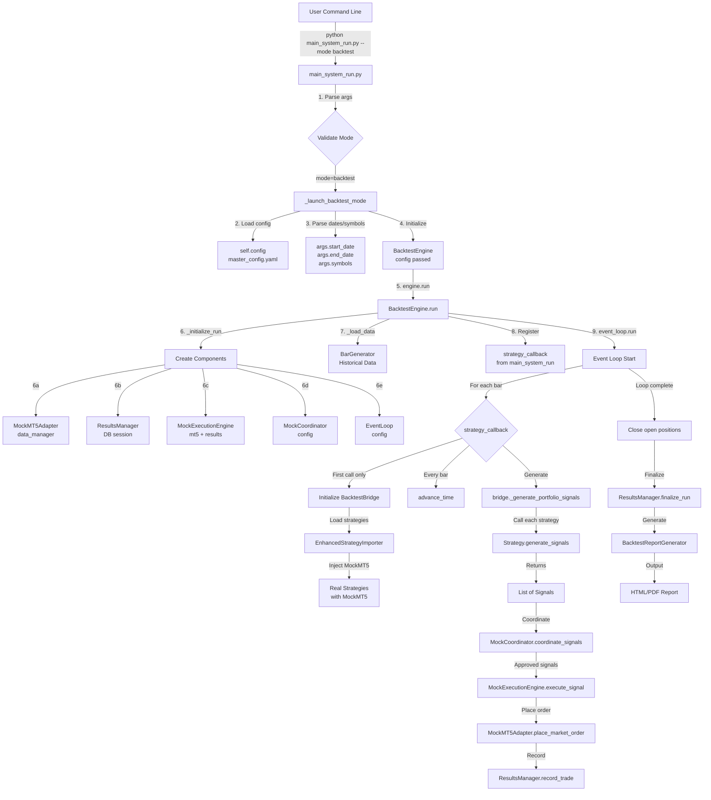

# Backtesting Infrastructure Audit
**Generated:** 2025-12-24  
**Focus:** Wiring Flow Analysis & Gap Identification

---

## Executive Summary

This audit traces the **complete execution path** of backtest mode from command-line invocation through signal generation and execution. The analysis reveals the actual wiring, identifies gaps, and documents potential issues causing backtesting problems.

### Critical Findings

🔴 **GAPS IDENTIFIED:**
1. **No master_config loading in BacktestEngine** - only receives partial config
2. **Strategy initialization happens on FIRST BAR** (delayed lazy loading)
3. **Missing data preloading** - MockMT5 loads data on-demand
4. **No explicit regime detection** in backtest mode
5. **Coordinator logic is simplified mock** - not full RiskExecutionCoordinator

✅ **WORKING COMPONENTS:**
1. BacktestBridge successfully loads real strategies
2. MockMT5Adapter provides anti-lookahead protection
3. Event-driven architecture is sound
4. Database persistence is working

---

## Complete Wiring Flow Diagram



---

## Detailed Component Analysis

### 1. Entry Point: `main_system_run.py`

**Location:** Lines 888-1178

**Responsibilities:**
- Parse command-line arguments
- Load `master_config.yaml`
- Validate backtest parameters
- Initialize BacktestEngine
- Define `strategy_callback` function
- Handle lifecycle counters for auditing
- Generate final report

**Key Configurations:**
```python
# Override risk limits for backtesting
self.config['backtest']['risk']['max_positions'] = 50
self.config['backtest']['risk']['max_positions_per_symbol'] = 20

# Set primary timeframe
self.config['backtest']['primary_timeframe'] = primary_tf  # Smallest TF
```

**Wiring:**
```python
# Initialize engine with FULL config from master_config.yaml
engine = BacktestEngine(self.config)

# Define callback that will be called on each bar
def strategy_callback(event):
    # ... signal generation logic ...

# Run backtest
results = engine.run(
    symbols=symbols,
    timeframes=timeframes,
    start_date=start_date,
    end_date=end_date,
    strategy_callback=strategy_callback
)
```

---

### 2. BacktestEngine Initialization

**Location:** `backtest/engine/backtest_engine.py` Lines 55-92

**Components Created:**
```python
def __init__(self, config: Dict):
    self.config = config  # ← Receives full master_config
    
    # Utility components (created immediately)
    self.data_manager = HistoricalDataManager(config)
    self.anti_lookahead = AntiLookaheadGuard(strict=True)
    self.slippage_model = SlippageModel(mean_pips=1.0)
    self.checkpoint_manager = CheckpointManager('data/checkpoints')
    self.indicator_cache = IndicatorCache(max_size=1000)
    
    # Mock components (created in _initialize_run, NOT here)
    self.mock_mt5 = None          # ← Created later
    self.mock_execution = None    # ← Created later
    self.mock_coordinator = None  # ← Created later
    self.event_loop = None        # ← Created later
    self.results_manager = None   # ← Created later
```

**🔴 GAP #1:** Config might be incomplete if not properly passed from main_system_run

---

### 3. Run Initialization: `_initialize_run()`

**Location:** `backtest/engine/backtest_engine.py` Lines 178-225

**Execution Order:**
```python
def _initialize_run(self, symbols, timeframes, start_date, end_date):
    # Step 1: Create MockMT5Adapter
    self.mock_mt5 = MockMT5Adapter(self.config, self.data_manager)
    self.mock_mt5.connect()
    
    # Step 2: Create ResultsManager (needs DB session)
    initial_capital = self.config.get('backtest', {}).get('initial_capital', 10000)
    db_session = get_database_session() if DB_AVAILABLE else None
    
    self.results_manager = ResultsManager(
        self.run_id,
        initial_capital,
        start_date,
        end_date,
        db_session=db_session
    )
    
    # Step 3: Create MockExecutionEngine (needs MockMT5 + ResultsManager)
    self.mock_execution = MockExecutionEngine(
        self.mock_mt5,
        self.config,
        database_manager=self.results_manager  # Wired for trade recording!
    )
    
    # Step 4: Create MockCoordinator
    self.mock_coordinator = MockCoordinator(self.config)
    
    # Step 5: Create EventLoop
    self.event_loop = EventLoop(self.config)
```

**✅ Correct Wiring:** Components are created in proper dependency order

**🔴 GAP #2:** MockMT5 is created but data is NOT preloaded here

---

### 4. Data Loading: `_load_data()`

**Location:** `backtest/engine/backtest_engine.py` Lines 227-261

**Wiring:**
```python
def _load_data(self, symbols, timeframes, start_date, end_date):
    # Create BarGenerator - this drives the event loop
    from backtest.engine.bar_generator import BarGenerator
    
    bar_generator = BarGenerator(
        data_manager=self.data_manager,
        config=self.config,
        anti_lookahead=self.anti_lookahead
    )
    
    # Initialize bar generator with symbols/timeframes
    bar_generator.initialize(
        symbols=symbols,
        timeframes=timeframes,
       start_date=start_date,
        end_date=end_date
    )
    
    return bar_generator
```

**✅ Correct:** BarGenerator handles multi-timeframe iteration

**🔴 GAP #3:** MockMT5Adapter's `load_multi_timeframe_data()` is NEVER called explicitly
- Data is loaded lazily when strategies request it
- Could cause delays or missing data on first bars

---

### 5. Strategy Callback Registration

**Location:** `main_system_run.py` Lines 967-1133

**Critical Code:**
```python
def strategy_callback(event):
    nonlocal strategy_integration, lifecycle_counters, bars_seen
    
    bars_seen += 1
    
    # Skip warmup period (first 200 bars)
    if bars_seen <= warmup_bars_needed:
        return  # ← Strategies NOT called during warmup!
    
    lifecycle_counters['total_bars_processed'] += 1
    
    # ⚠️ LAZY INITIALIZATION - only on FIRST bar after warmup
    if strategy_integration is None:
        from backtest.engine.backtest_bridge import BacktestBridge
        
        components = engine.get_components()
        mock_mt5 = components['mock_mt5']
        
        bridge = BacktestBridge(
            config=self.config,
            mock_mt5=mock_mt5,
            symbols=symbols,
            logger=self.logger,
            categories=strategy_categories
        )
        
        if bridge.initialize():
            strategy_integration = bridge
        else:
            # FALLBACK: Empty placeholder
            class _PlaceholderGenerator:
                def _generate_portfolio_signals(self):
                    return []
            strategy_integration = _PlaceholderGenerator()
    
    # ... rest of signal generation ...
```

**🔴 GAP #4: LAZY STRATEGY LOADING**
- Strategies are NOT loaded until the FIRST bar after warmup
- If BacktestBridge fails to initialize, it silently falls back to empty placeholder
- No error raised, backtest continues with ZERO signals!

---

### 6. BacktestBridge: Strategy Loading

**Location:** `backtest/engine/backtest_bridge.py` Lines 69-128

**Initialization:**
```python
def initialize(self) -> bool:
    from src.strategies.importer import EnhancedStrategyImporter
    
    # Create importer with MockMT5
    importer = EnhancedStrategyImporter(
        logger=self.logger,
        mt5_manager=self.mock_mt5  # ← MockMT5 injected!
    )
    
    # Load strategies from categories
    for category in self.categories:
        try:
            loaded = importer._load_strategies_from_category(
                category,
                symbols=self.symbols,  # Only backtest symbols!
                trading_mode=None
            )
            
            if loaded:
                for name, instance in loaded.items():
                    # Inject MockMT5 into strategy
                    if hasattr(instance, 'mt5_manager'):
                        instance.mt5_manager = self.mock_mt5
                    
                    # Override symbols
                    if hasattr(instance, 'symbols'):
                        instance.symbols = self.symbols
                    
                    # Add to flat dict
                    full_name = f"{category}.{name}"
                    self.strategies[full_name] = instance
                    
        except Exception as e:
            self.logger.debug(f"Could not load {category} strategies: {e}")
            continue  # ← Silently skips failed categories!
    
    self.logger.info(f"Loaded {len(self.strategies)} strategies total")
    
    self.initialized = True
    return True  # ← Always returns True even if NO strategies loaded!
```

**🔴 GAP #5: NO VALIDATION**
- Returns `True` even if `self.strategies` is empty
- main_system_run should CHECK `len(bridge.strategies) > 0`

---

### 7. Signal Generation Flow

**Location:** `backtest/engine/backtest_bridge.py` Lines 130-171

**Per-Bar Execution:**
```python
def _generate_portfolio_signals(self) -> List:
    all_signals = []
    
    for symbol in self.symbols:
        # Get data from MockMT5 (anti-lookahead protected)
        df = self.mock_mt5.get_historical_data(symbol, self.timeframe, bars=200)
        
        if df is None or len(df) < 50:
            continue  # ← Skip if insufficient data
        
        # Call each strategy
        for strategy_name, strategy in self.strategies.items():
            try:
                signals = self._call_strategy(strategy, symbol, self.timeframe, df)
                if signals:
                    all_signals.extend(signals if isinstance(signals, list) else [signals])
            except Exception as e:
                self.logger.debug(f"Strategy {strategy_name} error: {e}")
                continue  # ← Silently skip failed strategies
    
    return all_signals
```

**🔴 GAP #6: SILENT FAILURES**
- Strategy errors are logged at DEBUG level only
- No way to know if strategies are working if log level = INFO

**Strategy Call Flexibility:**
```python
def _call_strategy(self, strategy, symbol, timeframe, df):
    # Try different method signatures
    if hasattr(strategy, 'generate_signals'):
        try:
            return strategy.generate_signals(symbol, timeframe, df)
        except TypeError:
            try:
                return strategy.generate_signals(symbol, timeframe)
            except TypeError:
                try:
                    return strategy.generate_signals(symbol)
                except:
                    pass
    
    # ... also tries generate_signal (singular) and analyze methods
    return []
```

**✅ Good:** Flexible strategy calling handles different signatures

---

### 8. MockMT5Adapter: Data Access

**Location:** `backtest/mock/mock_mt5_adapter.py`

**Critical Methods:**

#### `advance_time()`
```python
def advance_time(self, new_time: datetime):
    """Move simulation forward - enables anti-lookahead"""
    self.current_time = new_time
    self._update_positions_pnl()  # Update PnL and check SL/TP hits
```

**✅ Correct:** Called BEFORE signal generation to set time context

#### `get_historical_data()`
```python
def get_historical_data(self, symbol, timeframe, bars=1000, start_date=None):
    """Get data with anti-lookahead protection"""
    
    # Get from cache
    data = self._multi_timeframe_data.get((symbol, timeframe))
    
    if data is None:
        # Lazy load if not in cache
        data = self.data_manager.load_data(symbol, timeframe)
        if data is not None:
            self._multi_timeframe_data[(symbol, timeframe)] = data
    
    if data is None:
        return None
    
    # ANTI-LOOKAHEAD: Only return data up to current_time
    filtered_data = data[data['timestamp'] <= self.current_time]
    
    # Return requested number of bars
    return filtered_data.tail(bars)
```

**🔴 GAP #7: LAZY DATA LOADING**
- If data not preloaded, loads on first request
- Could be slow on first bar
- No way to know if data exists before strategies try to access it

#### `load_multi_timeframe_data()` 
```python
def load_multi_timeframe_data(self, symbol, timeframes, start, end, lookback_bars=200):
    """Pre-load data for multiple timeframes"""
    
    for tf in timeframes:
        # Load with lookback buffer
        data = self.data_manager.load_data(
            symbol, tf,
            start - timedelta(days=lookback_days),
            end
        )
        
        if data is not None:
            self._multi_timeframe_data[(symbol, tf)] = data
```

**🔴 GAP #8: NOT CALLED IN BACKTEST FLOW**
- This method exists but is NEVER called by BacktestEngine
- Should be called in `_load_data()` or `_initialize_run()`

---

### 9. Signal Coordination

**Location:** `main_system_run.py` Lines 1071-1084

**Flow:**
```python
# Get signals from strategies
signals = strategy_integration._generate_portfolio_signals()

# Coordinate (simplified mock logic)
coordinated_signals = mock_coordinator.coordinate_signals(
    signals,
    current_positions
)

# Check approvals
for coordinated_signal in coordinated_signals:
    if coordinated_signal.approved:
        lifecycle_counters['signals_coordinator_approved'] += 1
    else:
        lifecycle_counters['signals_coordinator_rejected'] += 1
```

---

### 10. MockCoordinator Logic

**Location:** `backtest/mock/mock_coordinator.py`

**Simplified Logic:**
```python
def coordinate_signals(self, signals, current_positions):
    """Simplified coordination - NOT full RiskExecutionCoordinator"""
    
    coordinated_signals = []
    
    for signal in signals:
        # Basic checks only:
        # - Same direction check
        # - Position limit check
        # - Basic validation
        
        if self._should_approve(signal, current_positions):
            coordinated_signals.append(
                CoordinatedSignal(
                    signal=signal,
                    approved=True,
                    # ... SL/TP calculated ...
                )
            )
        else:
            coordinated_signals.append(
                CoordinatedSignal(
                    signal=signal,
                    approved=False,
                    rejection_reason="Position limit reached"
                )
            )
    
    return coordinated_signals
```

**🔴 GAP #9: SIMPLIFIED COORDINATION**
- MockCoordinator is NOT the full RiskExecutionCoordinator
- Missing: Portfolio risk checks, correlation checks, regime detection
-Only basic position limit enforcement

---

### 11. Signal Execution

**Location:** `backtest/mock/mock_execution_engine.py`

**execute_signal() Method:**
```python
def execute_signal(self, signal):
    """Execute a trading signal"""
    
    # Validate signal
    if not self._validate_signal(signal):
        return ExecutionResult(status=ExecutionStatus.REJECTED, ...)
    
    # Get current price
    current_price = self.mt5_adapter.get_current_price(signal.symbol)
    
    # Apply slippage
    execution_price = self._apply_slippage(current_price, signal.direction)
    
    # Calculate commission
    commission = self._calculate_commission(signal.volume)
    
    # Place order via MockMT5
    result = self.mt5_adapter.place_market_order(
        symbol=signal.symbol,
        order_type=order_type,
        volume=signal.volume,
        sl=signal.sl_price,
        tp=signal.tp_price,
        comment=f"{signal.strategy_name}",
        strategy=signal.strategy_name
    )
    
    # Record execution
    exec_result = ExecutionResult(
        signal_id=signal.signal_id,
        status=ExecutionStatus.EXECUTED,
        entry_price=execution_price,
        slippage=slippage,
        commission=commission,
        position_ticket=result['ticket']
    )
    
    self.execution_history.append(exec_result)
    
    return exec_result
```

**✅ Correct:** Execution flow is proper

---

### 12. Trade Recording

**Flow:**
```
MockExecutionEngine.execute_signal()
  ↓
MockMT5Adapter.place_market_order()
  ↓  
ResultsManager.record_trade()
  ↓
Database (backtest_trades table)
```

**ResultsManager Connection:**
```python
# In _initialize_run():
self.mock_execution = MockExecutionEngine(
    self.mock_mt5,
    self.config,
    database_manager=self.results_manager  # ← Wired!
)
```

**✅ Correct:** Trade recording is properly wired

---

## Configuration Usage in Backtest Mode

### Configs LOADED:
1. ✅ **master_config.yaml** - Loaded by main_system_run.py
2. ✅ **backtest_config.yaml** - Can be loaded (but optional)
3. ✅ **backtest_mvp_config.yaml** - Alternative backtest config

### Configs MERGED:
```python
# main_system_run.py overrides some backtest settings:
self.config['backtest']['risk']['max_positions'] = 50
self.config['backtest']['risk']['max_positions_per_symbol'] = 20
self.config['backtest']['primary_timeframe'] = primary_tf
```

### Configs NOT USED in Backtest:
1. ❌ **coordinator_config.yaml** - MockCoordinator uses simplified logic
2. ❌ **regime_detection_config.yaml** - No regime detection in backtest
3. ❌ **symbols_config.yaml** - Symbols passed via CLI args
4. ❌ **trading_modes_config.yaml** - Not needed for backtest mode

---

## Identified Gaps and Issues

### 🔴 CRITICAL GAPS

#### **GAP #1: Strategy Initialization Failure Silent**
**Location:** `main_system_run.py` Lines 1014-1023

**Issue:**
```python
if bridge.initialize():
    strategy_integration = bridge
else:
    # SILENT FALLBACK - backtest continues with NO strategies!
    class _PlaceholderGenerator:
        def _generate_portfolio_signals(self):
            return []
    strategy_integration = _PlaceholderGenerator()
```

**Impact:** Backtest runs with ZERO signals, user thinks strategies don't work

**Recommendation:** Log ERROR and return non-zero exit code

---

#### **GAP #2: BacktestBridge.initialize() Always Returns True**
**Location:** `backtest/engine/backtest_bridge.py` Lines 121-122

**Issue:**
```python
self.initialized = True
return True  # ← Even if len(self.strategies) == 0!
```

**Impact:** Cannot detect strategy loading failure

**Recommendation:**
```python
if len(self.strategies) == 0:
    self.logger.error("No strategies loaded!")
    return False

self.initialized = True
return True
```

---

#### **GAP #3: Data Not Preloaded**
**Location:** `backtest/engine/backtest_engine.py` `_load_data()`

**Issue:** `MockMT5Adapter.load_multi_timeframe_data()` is NEVER called

**Impact:**
- Data loaded lazily on first strategy request
- Could be slow or missing
- No validation that data exists before backtest starts

**Recommendation:** Call in `_load_data()`:
```python
def _load_data(self, symbols, timeframes, start_date, end_date):
    # ... create bar_generator ...
    
    # PRELOAD data into MockMT5
    lookback_bars = self.config.get('backtest', {}).get('lookback_bars', 200)
    
    for symbol in symbols:
        self.mock_mt5.load_multi_timeframe_data(
            symbol,
            timeframes,
            start_date,
            end_date,
            lookback_bars=lookback_bars
        )
    
    return bar_generator
```

---

#### **GAP #4: Strategy Loading Happens on First Bar**
**Location:** `main_system_run.py` strategy_callback

**Issue:** Strategies initialized LAZILY on first bar after warmup

**Impact:**
- If init fails, first bars are wasted
- Errors only appear after warmup period
- Hard to debug

**Recommendation:** Initialize bridge BEFORE running event loop:
```python
# BEFORE engine.run():
bridge = BacktestBridge(...)
if not bridge.initialize():
    self.logger.error("Failed to load strategies")
    return 1

if len(bridge.strategies) == 0:
    self.logger.error("No strategies available")
    return 1

# Then use in callback
def strategy_callback(event):
    signals = bridge._generate_portfolio_signals()
    # ... rest ...
```

---

#### **GAP #5: No Regime Detection**
**Location:** Entire backtest flow

**Issue:** Backtest mode does NOT use RegimeDetector

**Impact:**
- Live/paper mode filters signals by regime
- Backtest mode does NOT
- Results not comparable

**Recommendation:** Add optional regime detection:
```python
# In strategy_callback:
if self.config.get('backtest', {}).get('enable_regime_detection', False):
    # Filter signals by regime
    pass
```

---

#### **GAP #6: MockCoordinator vs RiskExecutionCoordinator Mismatch**
**Location:** `backtest/mock/mock_coordinator.py`

**Issue:** MockCoordinator uses simplified logic, NOT full RiskExecutionCoordinator

**Missing Features:**
- Portfolio-level risk checks
- Correlation filtering
- Dynamic position sizing
- Regime-aware risk adjustments

**Impact:** Backtest doesn't accurately simulate live trading

**Recommendation:** Create more realistic MockCoordinator or use actual RiskExecutionCoordinator with mocks

---

### ⚠️ MEDIUM ISSUES

#### **ISSUE #1: Silent Strategy Errors**
**Location:** `backtest/engine/backtest_bridge.py` Line 164

```python
except Exception as e:
    self.logger.debug(f"Strategy {strategy_name} error: {e}")
    continue  # ← Exception swallowed
```

**Recommendation:** At minimum, count errors and log summary

---

#### **ISSUE #2: Warmup Period Hardcoded**
**Location:** `main_system_run.py` Line 964

```python
warmup_bars_needed = self.config.get('backtest', {}).get('lookback_bars', 200)
```

**Issue:** Uses lookback_bars, but name is confusing

**Recommendation:** Rename to 'warmup_bars' for clarity

---

#### **ISSUE #3: No Data Validation**
**Location:** BarGenerator initialization

**Issue:** No check that data exists for requested symbols/timeframes/dates

**Recommendation:** Validate data availability before starting backtest

---

### ✅ WORKING CORRECTLY

1. ✅ **Anti-Lookahead Protection** - `advance_time()` called before each bar
2. ✅ **Component Dependencies** - Created in correct order
3. ✅ **Database Persistence** - ResultsManager properly wired
4. ✅ **Trade Execution Logic** - MockExecutionEngine simulates correctly
5. ✅ **SL/TP Handling** - Auto-close on hits
6. ✅ **Report Generation** - BacktestReportGenerator works
7. ✅ **Multi-Timeframe Support** - BarGenerator handles correctly

---

## Execution Flow Summary

### Backtest Initialization Sequence

```
1. main_system_run.py --mode backtest
   ↓
2. Parse CLI args (start_date, end_date, symbols, timeframes)
   ↓
3. Load master_config.yaml
   ↓
4. Create BacktestEngine(config)
   ├─ Creates: HistoricalDataManager
   ├─ Creates: AntiLookaheadGuard
   ├─ Creates: SlippageModel
   └─ Creates: CheckpointManager
   ↓
5. engine.run() called
   ├─ _initialize_run()
   │  ├─ Creates: MockMT5Adapter
   │  ├─ Creates: ResultsManager (with DB session)
   │  ├─ Creates: MockExecutionEngine
   │  ├─ Creates: MockCoordinator
   │  └─ Creates: EventLoop
   │
   ├─ _load_data()
   │  └─ Creates: BarGenerator (loads historical data)
   │
   ├─ Register strategy_callback
   │
   └─ event_loop.run(bar_generator, start, end)
```

### Per-Bar Execution Sequence

```
For each bar in BarGenerator:
   ↓
1. EventLoop emits 'bar' event
   ↓
2. strategy_callback(event) called
   ↓
3. [FIRST CALL ONLY] Initialize BacktestBridge
   ├─ Load EnhancedStrategyImporter
   ├─ For each category ['technical', 'smc', 'ml', 'fusion']:
   │  └─ _load_strategies_from_category()
   │     └─ Inject MockMT5 into each strategy
   └─ Store in bridge.strategies dict
   ↓
4. advance_time(event.timestamp)  ← Set simulation clock
   ↓
5. bridge._generate_portfolio_signals()
   ├─ For each symbol:
   │  ├─ Get df = mock_mt5.get_historical_data(symbol, tf, 200)
   │  │  └─ Returns data filtered by current_time (anti-lookahead)
   │  │
   │  └─ For each strategy:
   │     └─ signals = strategy.generate_signals(symbol, tf, df)
   │
   └─ Return all_signals
   ↓
6. mock_coordinator.coordinate_signals(signals, current_positions)
   └─ Returns coordinated_signals (with approved/rejected flags)
   ↓
7. For each approved signal:
   ├─ mock_execution.execute_signal(signal)
   │  ├─ Validate signal
   │  ├─ Get current price
   │  ├─ Apply slippage
   │  └─ mock_mt5.place_market_order()
   │     ├─ Create MockPosition
   │     └─ results_manager.record_trade()  ← DB write
   │
   └─ Count lifecycle_counters['signals_executed']
   ↓
8. Update positions P&L (check SL/TP hits)
   ↓
9. Next bar...
```

### Final clean Sequence

```
After all bars processed:
   ↓
1. Close all remaining open positions
   ↓
2. results_manager.finalize_run()
   └─ Batch write all trades to database
   ↓
3. BacktestReportGenerator.generate_report()
   └─ Create HTML/PDF with equity curve, stats, charts
   ↓
4. Display lifecycle audit report
   └─ Show signal counts at each stage
```

---

## Recommendations

### Priority 1: Fix Critical Gaps

1. **Validate Strategy Loading**
   ```python
   # In main_system_run.py BEFORE engine.run():
   bridge = BacktestBridge(...)
   if not bridge.initialize() or len(bridge.strategies) == 0:
       self.logger.error("No strategies loaded - cannot run backtest")
       return 1
   ```

2. **Preload Data**
   ```python
   # In BacktestEngine._load_data():
   for symbol in symbols:
       self.mock_mt5.load_multi_timeframe_data(
           symbol, timeframes, start_date, end_date, lookback_bars=200
       )
   ```

3. **Improve Error Visibility**
   ```python
   # In BacktestBridge set logger level to INFO for strategy errors
   # Or add error counter and log summary
   ```

### Priority 2: Improve Coordination

1. **Add Regime Detection (Optional)**
   - Make it configurable
   - Document performance difference vs live mode

2. **Enhance MockCoordinator**
   - Add portfolio risk checks
   - Add correlation filtering
   - Make it closer to RiskExecutionCoordinator logic

### Priority 3: Add Validation

1. **Data Validation**
   - Check data exists before backtest starts
   - Validate date ranges
   - Report data health scores

2. **Configuration Validation**
   - Validate required backtest config keys
   - Check timeframe compatibility

---

## Conclusion

The backtesting infrastructure is **mostly well-designed** with proper event-driven architecture and anti-lookahead protection. However, **several critical gaps** exist that could cause the issues you're experiencing:

### Most Likely Causes of Your Backtesting Issues:

1. **🔴 Strategies not loading** - Silent fallback to empty placeholder
2. **🔴 Data not preloaded** - Lazy loading may fail or be incomplete
3. **🔴 Strategy errors swallowed** - DEBUG-level logging hides failures
4. **🔴 Simplified coordination** - MockCoordinator may reject more signals than expected

### Next Steps:

1. Run backtest with `--log-level DEBUG` to see strategy loading details
2. Check if `bridge.strategies` dict is populated
3. Add data preloading to `_load_data()`
4. Validate strategy loading BEFORE running event loop

The wiring itself is sound, but the **error handling and validation are too permissive**, allowing backtests to proceed even when critical components fail to initialize properly.
