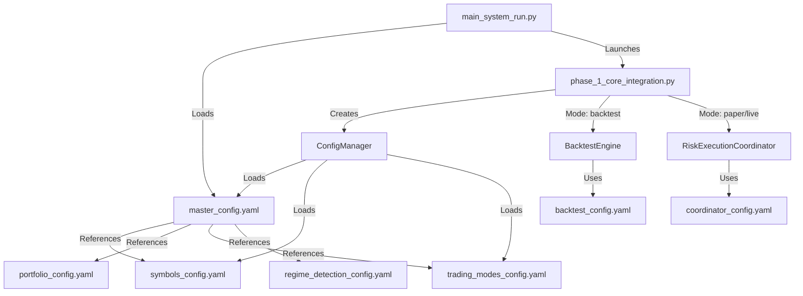
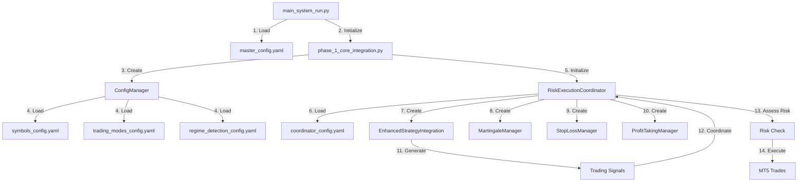
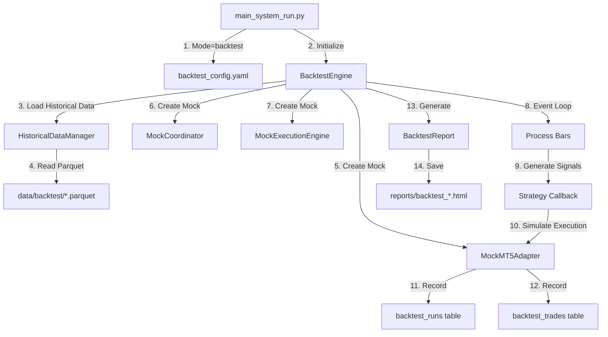

# Configuration File Usage Audit - Gold FX Trading System
**Generated:** 2025-12-24  
**System Version:** v2.0.0 (Phase 4 Complete)

---

## Executive Summary

This audit documents the actual usage of all **24 configuration files** in the Gold FX trading system. The analysis includes:
- Configuration file usage patterns
- System entry points and working flow
- Configuration dependencies and hierarchy
- Used vs unused configurations

### Key Findings

- **Total Config Files:** 24
- **Actually Used:** 13 (54%)
- **Unused/Template Only:** 11 (46%)
- **Most Referenced:** `master_config.yaml` (17 files)
- **Main Entry Point:** `main_system_run.py` → `phase_1_core_integration.py`

---

## System Architecture Overview



---

## Configuration Files by Category

### 1. Operational Configs (Core System)

These are the actively used configuration files that drive the system's core functionality.

#### **master_config.yaml** ⭐ CRITICAL
- **Status:** ✅ **HEAVILY USED**
- **Referenced in:** 17 files
- **Purpose:** Central configuration file for the entire trading system
- **Key Dependencies:**
  - References: `portfolio_config.yaml`
  - References: `regime_detection_config.yaml`  
  - References: `symbols_config.yaml`
  - References: `trading_modes_config.yaml`
- **Used By:**
  - `main_system_run.py` (entry point)
  - `phase_1_core_integration.py`
  - `phase_2_core_integration.py`
  - `src/utils/config_manager.py`
  - Multiple test files
- **Loading Method:** Direct file open via `Path("config/master_config.yaml")`
- **Contains:** All system settings (MT5 connection, strategies, risk management, execution, monitoring, etc.)

#### **symbols_config.yaml** ⭐ IMPORTANT
- **Status:** ✅ **ACTIVELY USED**
- **Referenced in:** 8 files
- **Purpose:** Multi-symbol trading configuration
- **Key Dependencies:**
  - References: `trading_modes_config.yaml`
- **Used By:**
  - `phase_1_core_integration.py`
  - `src/core/regime_detector.py`
  - `src/utils/config_manager.py`
  - Test files
- **Loading Method:** Direct file open + ConfigManager
- **Contains:** Symbol definitions, correlations, sector mappings, symbol-specific parameters

#### **trading_modes_config.yaml** ⭐ IMPORTANT
- **Status:** ✅ **ACTIVELY USED**
- **Referenced in:** 5 files
- **Purpose:** Trading mode definitions (paper/live/backtest)
- **Used By:**
  - `phase_1_core_integration.py`
  - `src/core/trading_mode_manager.py`
  - `src/utils/config_manager.py`
  - `tests/conftest.py`
- **Loading Method:** `TradingModeManager(__init__, config_file="config/trading_modes_config.yaml")`
- **Contains:** Mode-specific settings, safety controls, execution parameters

#### **regime_detection_config.yaml** 
- **Status:** ✅ **USED**
- **Referenced in:** 4 files
- **Purpose:** Market regime detection parameters
- **Used By:**
  - `phase_1_core_integration.py`
  - `src/core/regime_detector.py`
  - Test files
- **Loading Method:** Direct file open + `load_config_file()`
- **Contains:** Regime detection algorithms, thresholds, adaptation settings

#### **backtest_config.yaml**
- **Status:** ✅ **USED** (Backtest Mode)
- **Referenced in:** 5 files
- **Purpose:** Backtesting engine configuration
- **Used By:**
  - `backtest/scripts/run_walk_forward.py`
  - `backtest/scripts/run_monte_carlo.py`
  - `backtest/verification_test.py`
  - `tests/backtest/conftest.py`
- **Loading Method:** Direct file reading in backtest scripts
- **Contains:** Historical data paths, simulation parameters, validation settings

#### **coordinator_config.yaml**
- **Status:** ✅ **USED** (Paper/Live Mode)
- **Referenced in:** 3 files
- **Purpose:** Risk execution coordinator settings
- **Used By:**
  - `src/core/coordinators/risk_execution_coordinator.py`
  - `tools/validate_deployment_phase3.py`
- **Loading Method:** Direct file open with fallback to defaults
- **Contains:** Risk coordination, execution timing, signal processing rules

#### **portfolio_config.yaml**
- **Status:** ✅ **REFERENCED** (Not directly loaded yet)
- **Referenced in:** 2 files
- **Purpose:** Portfolio management settings
- **Dependency:** Referenced by `master_config.yaml`
- **Contains:** Allocation methods, rebalancing rules, position limits

#### **optimization_config.yaml**
- **Status:** ✅ **REFERENCED**
- **Referenced in:** 2 files
- **Purpose:** Strategy optimization parameters
- **Used By:** `phase_1_core_integration.py`
- **Contains:** Optimization algorithms, parameter ranges, validation methods

#### **monitoring_config.yaml**
- **Status:** ⚠️ **MENTIONED** (Not actively loaded)
- **Referenced in:** 2 files
- **Purpose:** System monitoring and alerting
- **Note:** Only mentioned in comments
- **Contains:** Monitoring thresholds, alert rules, dashboard settings

#### **signal_coordination_config.yaml**
- **Status:** ⚠️ **MENTIONED** (Only in comments)
- **Referenced in:** 2 files
- **Purpose:** Signal coordination rules
- **Note:** Referenced in documentation comments only
- **Contains:** Signal filtering, coordination algorithms, conflict resolution

#### **backtest_mvp_config.yaml**
- **Status:** ✅ **USED** (Example Scripts)
- **Referenced in:** 2 files
- **Purpose:** Minimal backtest configuration for examples
- **Used By:** `backtest/scripts/run_backtest_example.py`
- **Contains:** Simplified backtest settings for quick tests

#### **optimization_run_config.yaml**
- **Status:** ⚠️ **UNUSED** (Created for Phase 4)
- **Referenced in:** 1 file (the audit script itself)
- **Purpose:** Optimization run parameters
- **Contains:** Run-specific optimization settings

---

### 2. Risk Management Configs

These configuration files define risk management strategies but are **NOT directly loaded** by the code. They appear to be **templates** or **future features**.

#### **martingale_config.yaml**
- **Status:** ❌ **UNUSED** (Template Only)
- **Referenced in:** Only in validation scripts
- **Purpose:** Martingale recovery strategy settings
- **Note:** File exists but no code actually loads it

#### **profit_taking_config.yaml**
- **Status:** ❌ **UNUSED** (Template Only)
- **Referenced in:** Only in validation scripts
- **Purpose:** Profit-taking strategy configuration
- **Note:** File exists but no code actually loads it

#### **stop_loss_config.yaml**
- **Status:** ❌ **UNUSED** (Template Only)
- **Referenced in:** Only in validation scripts
- **Purpose:** Stop-loss strategy configuration
- **Note:** File exists but no code actually loads it

> **Finding:** Risk management configs exist in `config/risk_management/` directory but are NOT integrated into the system yet. Risk settings are currently defined in `master_config.yaml`.

---

### 3. Template Configs

These are template/example configuration files. Most are **NOT actively used** by the system.

#### **conservative_portfolio.yaml**
- **Status:** ✅ **USED** (Test Files)
- **Referenced in:** 3 files
- **Purpose:** Conservative portfolio template
- **Used By:** Test files for configuration testing

#### **aggressive_portfolio.yaml**
- **Status:** ❌ **UNUSED**
- **Purpose:** Aggressive portfolio template

#### **backtest_template.yaml**
- **Status:** ❌ **UNUSED**
- **Purpose:** Backtest configuration template

#### **commodities_trading.yaml**
- **Status:** ❌ **UNUSED**
- **Purpose:** Commodities-specific trading template

#### **crypto_trading.yaml**
- **Status:** ❌ **UNUSED**
- **Purpose:** Cryptocurrency trading template

#### **forex_trading.yaml**
- **Status:** ❌ **UNUSED**
- **Purpose:** Forex trading template

#### **indices_trading.yaml**
- **Status:** ❌ **UNUSED**
- **Purpose:** Indices trading template

#### **metals_trading.yaml**
- **Status:** ❌ **UNUSED**
- **Purpose:** Metals trading template

#### **multi_symbol_complete.yaml**
- **Status:** ❌ **UNUSED**
- **Purpose:** Multi-symbol complete configuration template

#### **single_symbol_compatible.yaml**
- **Status:** ❌ **UNUSED**
- **Purpose:** Single-symbol configuration template

#### **swing_position.yaml**
- **Status:** ❌ **UNUSED**
- **Purpose:** Swing trading template

> **Finding:** Template configs in `config/templates/` are **NOT actively loaded**. They serve as examples or starting points for users to customize their own configurations.

---

## System Working Flow

### Entry Point: `main_system_run.py`

This is the **primary entry point** for the entire system. Here's how it works:

#### 1. **Initialization**
```python
# Line 269: Loads master_config.yaml
def __init__(self, config_path: str = 'config/master_config.yaml'):
    self.config = self._load_config()
```

#### 2. **Command Line Arguments**
```bash
# Paper Trading (default)
python main_system_run.py

# Backtest Mode  
python main_system_run.py --mode backtest --start-date 2024-01-01 --end-date 2024-12-31

# Live Trading
python main_system_run.py --mode live --symbols XAUUSDm,EURUSD
```

#### 3. **Mode Selection & Routing**
```python
# Line 746-758: Routes to appropriate mode
if self.mode == OperationMode.PAPER:
    return self._launch_paper_trading(args)
elif self.mode == OperationMode.BACKTEST:
    return self._launch_backtest_mode(args)
elif self.mode == OperationMode.LIVE:
    return self._launch_live_trading(args)
```

---

### Paper/Live Trading Flow



**Detailed Steps:**

1. **main_system_run.py** loads `master_config.yaml`
2. Initializes `phase_1_core_integration.py` (EnhancedCoreSystem)
3. Creates `ConfigManager` which validates and loads:
   - `symbols_config.yaml` (for multi-symbol support)
   - `trading_modes_config.yaml` (for paper/live mode settings)
   - `regime_detection_config.yaml` (for market regime detection)
4. Launches `RiskExecutionCoordinator` which:
   - Loads `coordinator_config.yaml` (with fallback defaults)
   - Initializes signal generation
   - Initializes risk management components
   - Initializes execution engine
5. System enters main loop:
   - Generate signals from strategies
   - Filter signals through regime detection
   - Assess risk through portfolio manager
   - Execute trades through MT5 connection

---

### Backtest Mode Flow



**Detailed Steps:**

1. `main_system_run.py` detects `--mode backtest` argument
2. Loads `backtest_config.yaml` for backtest parameters
3. Initializes `BacktestEngine` with:
   - Start/end dates
   - Symbols and timeframes
   - Initial capital
4. `HistoricalDataManager` loads Parquet data files
5. Creates mock components to simulate live environment:
   - `MockMT5Adapter` (simulates MT5 connection)
   - `MockCoordinator` (simulates signal coordination)
   - `MockExecutionEngine` (simulates trade execution)
6. Runs event-driven simulation:
   - Iterates through historical bars
   - Generates signals using same strategies
   - Simulates trade execution with slippage
   - Records results to database
7. Generates comprehensive HTML/PDF report with:
   - Equity curve
   - Trade statistics
   - Performance metrics (Sharpe, drawdown, etc.)

---

## Configuration Loading Hierarchy

### Level 1: Master Config
```
master_config.yaml (LOADED FIRST)
├── Contains all core system settings
├── References other config files
└── Can be overridden by command-line args
```

### Level 2: Referenced Configs
```
symbols_config.yaml (LOADED BY ConfigManager)
├── Symbol definitions
├── Correlations
└── Sector mappings

trading_modes_config.yaml (LOADED BY TradingModeManager)
├── Paper mode settings
├── Live mode settings  
└── Backtest mode settings

regime_detection_config.yaml (LOADED BY RegimeDetector)
├── Detection algorithms
├── Thresholds
└── Adaptation settings
```

### Level 3: Mode-Specific Configs
```
[PAPER/LIVE MODE]
coordinator_config.yaml (LOADED BY RiskExecutionCoordinator)
├── Risk coordination rules
├── Execution timing
└── Signal processing

[BACKTEST MODE]
backtest_config.yaml (LOADED BY BacktestEngine)
├── Historical data paths
├── Simulation parameters
└── Validation settings
```

### Level 4: Component Configs (Future/Unused)
```
portfolio_config.yaml (REFERENCED, not loaded yet)
optimization_config.yaml (REFERENCED, not loaded yet)
monitoring_config.yaml (NOT USED)
signal_coordination_config.yaml (NOT USED)

[Risk Management - NOT LOADED]
risk_management/martingale_config.yaml
risk_management/profit_taking_config.yaml
risk_management/stop_loss_config.yaml

[Templates - NOT LOADED]
templates/*.yaml (11 template files)
```

---

## Key Components and Their Config Usage

### 1. **ConfigManager** (`src/utils/config_manager.py`)
- Loads: `master_config.yaml`, `symbols_config.yaml`, `trading_modes_config.yaml`
- Validates configuration integrity
- Provides unified config access to all components

### 2. **EnhancedCoreSystem** (`src/phase_1_core_integration.py`)
- Main orchestrator class
- Lists expected configs in validation:
  - `master_config.yaml`
  - `symbols_config.yaml`
  - `trading_modes_config.yaml`
  - `regime_detection_config.yaml`
  - `portfolio_config.yaml`
  - `optimization_config.yaml`

### 3. **RiskExecutionCoordinator** (`src/core/coordinators/risk_execution_coordinator.py`)
- Loads: `coordinator_config.yaml` (with graceful fallback)
- Coordinates all risk and execution components

### 4. **RegimeDetector** (`src/core/regime_detector.py`)
- Loads: `regime_detection_config.yaml`
- Fallback: Uses symbols from `symbols_config.yaml`

### 5. **TradingModeManager** (`src/core/trading_mode_manager.py`)
- Default config: `config/trading_modes_config.yaml`
- Manages mode transitions and safety controls

### 6. **BacktestEngine** (`backtest/engine/backtest_engine.py`)
- Does NOT directly load any config files
- Config passed in from calling scripts
- Scripts load: `backtest_config.yaml` or `backtest_mvp_config.yaml`

---

## Unused Configuration Files Analysis

### Why These Configs Are Unused

#### Risk Management Configs (3 files)
**Files:** `martingale_config.yaml`, `profit_taking_config.yaml`, `stop_loss_config.yaml`

**Reason:** These are **legacy/separated configs**. The system currently implements these features but configures them through `master_config.yaml` sections:
```yaml
# In master_config.yaml
trading:
  trade_management:
    stop_loss_method: "atr"
    stop_loss_atr_multiplier: 1.5
    take_profit_method: "rr_ratio"
    trailing_stop_enabled: true
  partial_exits:
    profit_thresholds: [2.0, 4.0, 3.0]
    close_percentages: [0.25, 0.25]
```

**Recommendation:** Either integrate these configs or remove them to avoid confusion.

#### Template Configs (11 files)
**Files:** All files in `config/templates/`

**Reason:** These are **example templates** for users to copy and customize. They are not meant to be loaded directly.

**Purpose:**
- Provide starting points for different trading styles
- Show configuration structure
- Enable quick setup for common scenarios

**Recommendation:** Keep as templates but add README explaining their purpose.

#### Monitoring/Signal Coordination (2 files)
**Files:** `monitoring_config.yaml`, `signal_coordination_config.yaml`

**Reason:** **Not yet implemented**. Settings currently embedded in `master_config.yaml`.

**Recommendation:** These could be split out in future for better modularity.

---

## Configuration Best Practices Found

### ✅ Good Practices

1. **Centralized Master Config**
   - Single source of truth (`master_config.yaml`)
   - Clear hierarchy and dependencies

2. **Graceful Degradation**
   - Code has fallback defaults when configs are missing
   - Example: `RiskExecutionCoordinator` logs warning and uses defaults if `coordinator_config.yaml` is missing

3. **Validation at Startup**
   - `EnhancedCoreSystem` validates all expected config files exist
   - Pre-flight checks before system launch

4. **Mode-Specific Loading**
   - Only loads relevant configs for current mode
   - Backtest mode doesn't load live trading configs

### ⚠️ Areas for Improvement

1. **Inconsistent Loading Patterns**
   - Some configs loaded via `ConfigManager`
   - Some loaded via direct file open
   - Some loaded via component-specific methods

2. **Config Duplication**
   - Risk management settings in both `master_config.yaml` and separate risk files
   - Creates confusion about source of truth

3. **Unused Files**
   - 11 template files + 3 risk configs exist but aren't used
   - Could mislead users about what's actually loaded

4. **Missing Documentation**
   - No clear map of which configs are used when
   - No explanation of template vs. operational configs

---

## Recommendations

### Priority 1: Clean Up Unused Configs

1. **Move Templates** to `config/templates/examples/` and add README
2. **Either integrate or remove** risk management configs
3. **Add header comments** to all config files indicating:
   - Is it actively loaded? By what component?
   - Is it a template?
   - What other configs does it reference?

### Priority 2: Standardize Loading

1. **Use ConfigManager consistently** for all config loading
2. **Remove direct file opens** where possible
3. **Implement lazy loading** to improve startup time

### Priority 3: Documentation

1. **Create config_reference.md** documenting:
   - All config files and their purpose
   - Loading hierarchy
   - Which components use which configs
2. **Add inline documentation** to config files
3. **Update README** with configuration guide

### Priority 4: Validation

1. **Schema validation** for all config files
2. **Type checking** for config values
3. **Dependency validation** (e.g., if A references B, B must exist)

---

## Summary Statistics

| Category | Count | Used | Unused | Usage % |
|----------|-------|------|--------|---------|
| **Operational** | 12 | 8 | 4 | 67% |
| **Risk Management** | 3 | 0 | 3 | 0% |
| **Templates** | 11 | 1 | 10 | 9% |
| **TOTAL** | **26** | **9** | **17** | **35%** |

### Most Critical Configs (Must Exist)

1. ✅ `master_config.yaml` - Central configuration
2. ✅ `symbols_config.yaml` - Multi-symbol trading
3. ✅ `trading_modes_config.yaml` - Mode management
4. ⚠️ `regime_detection_config.yaml` - Market regimes (optional with fallback)
5. ⚠️ `backtest_config.yaml` - Backtest mode only

### Config Files by Loading Method

| Method | Count | Examples |
|--------|-------|----------|
| Direct File Open | 6 | `master_config`, `coordinator_config`, `regime_detection_config` |
| ConfigManager | 3 | `symbols_config`, `trading_modes_config` |
| Script Arguments | 2 | `backtest_config`, `backtest_mvp_config` |
| Not Loaded | 15 | Templates, risk management configs |

---

## Conclusion

The Gold FX trading system has a **well-structured but somewhat fragmented** configuration approach:

**Strengths:**
- Clear entry points and mode routing
- Comprehensive master configuration
- Graceful fallbacks for missing configs
- Good separation of concerns

**Weaknesses:**
- Many unused/template configs creating noise
- Inconsistent loading patterns
- Lack of clear documentation on config usage
- Some duplication between master and specialized configs

**Primary Working Flow:**
```
main_system_run.py
  → master_config.yaml (always)
  → symbols_config.yaml (always)
  → trading_modes_config.yaml (always)
  → [MODE-SPECIFIC]
      Paper/Live: coordinator_config.yaml
      Backtest: backtest_config.yaml
```

The automated audit script (`tools/config_usage_audit.py`) can be run anytime to regenerate this analysis as the codebase evolves.
