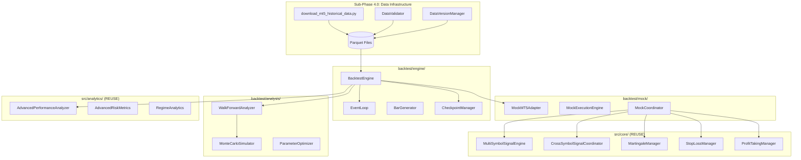

# Phase 4: Backtesting & Optimization Framework - REVISED Implementation Plan

## Executive Summary

**REVISION**: Incorporates all user feedback from initial review.

This document provides a comprehensive implementation plan for Phase 4 of the Gold_FX trading system. Phase 4 builds a production-grade backtesting framework with Parquet data storage, multi-timeframe support, checkpointing, parallel processing, and cloud-ready architecture.

| Metric | Value |
|--------|-------|
| **Timeline** | 25 days (-3 to 22) |
| **Sub-Phases** | 6 (4.0 - 4.5) |
| **Modules** | 24 primary modules |
| **Prompts** | 48 implementation tasks |
| **MVP Scope** | 3 symbols, 3 strategies, 6 timeframes |

---

## Approved Decisions

> [!NOTE]
> **User Approvals (Dec 21, 2025)**
> - ✅ **Option A**: Build in `backtest/`, reuse `src/analytics/`
> - ✅ **Remove** `analysis/` folder (blank placeholder files)
> - ✅ **Parquet** as primary format (CSV fallback)
> - ✅ **Multi-timeframe**: M1, M5, M15, H1, H4, D1 simultaneous support
> - ✅ **MVP**: 3 symbols × 3 strategies × 6 timeframes
> - ✅ **Cloud-ready**: Stateless design, Docker-prepared

---

## Architecture Overview

### Data Flow Diagram



### Directory Structure (Final)

```
Gold_FX/
├── backtest/                           # PRIMARY PHASE 4 TARGET
│   ├── __init__.py                     # [EXISTS]
│   ├── engine/                         # Core backtesting engine
│   │   ├── __init__.py
│   │   ├── backtest_engine.py          # ~400 lines
│   │   ├── event_loop.py               # ~300 lines
│   │   ├── bar_generator.py            # ~200 lines
│   │   └── parallel_backtest.py        # ~200 lines [NEW]
│   ├── data/                           # Historical data management
│   │   ├── __init__.py
│   │   ├── historical_data_manager.py  # ~400 lines (Parquet support)
│   │   ├── data_validator.py           # ~200 lines
│   │   ├── data_versioning.py          # ~150 lines [NEW]
│   │   ├── lazy_data_loader.py         # ~150 lines [NEW]
│   │   └── storage_backend.py          # ~200 lines [NEW - cloud-ready]
│   ├── mock/                           # Mock adapters
│   │   ├── __init__.py
│   │   ├── mock_mt5_adapter.py         # ~350 lines (multi-TF)
│   │   ├── mock_execution_engine.py    # ~200 lines
│   │   └── mock_coordinator.py         # ~250 lines
│   ├── analysis/                       # Backtest-specific analysis
│   │   ├── __init__.py
│   │   ├── walk_forward_analyzer.py    # ~400 lines
│   │   ├── monte_carlo_simulator.py    # ~350 lines
│   │   ├── parameter_optimizer.py      # ~400 lines
│   │   └── out_of_sample_validator.py  # ~200 lines
│   ├── reports/                        # Report generation
│   │   ├── __init__.py
│   │   ├── backtest_report_generator.py # ~300 lines
│   │   └── templates/
│   │       └── backtest_report.html
│   ├── results/                        # Results management
│   │   ├── __init__.py
│   │   └── results_manager.py          # ~200 lines
│   ├── validation/                     # Performance validation [NEW]
│   │   ├── __init__.py
│   │   └── performance_validator.py    # ~250 lines
│   └── utils/                          # Backtest utilities
│       ├── __init__.py
│       ├── anti_lookahead.py           # ~150 lines
│       ├── slippage_model.py           # ~100 lines
│       ├── checkpoint_manager.py       # ~200 lines [NEW]
│       └── indicator_cache.py          # ~150 lines [NEW]
├── Scripts_Project/
│   ├── download_mt5_historical_data.py # ~400 lines [NEW - MVP]
│   ├── validate_data_quality.py        # ~200 lines [NEW]
│   ├── run_backtest_example.py
│   ├── run_walk_forward.py
│   └── run_monte_carlo.py
├── config/
│   ├── backtest_config.yaml            # [NEW]
│   ├── backtest_mvp_config.yaml        # [NEW - MVP scope]
│   ├── optimization_run_config.yaml    # [NEW]
│   ├── backtest_local.yaml             # [NEW - cloud-ready]
│   ├── backtest_cloud.yaml             # [NEW - cloud-ready]
│   └── templates/
│       └── backtest_template.yaml
├── data/
│   └── historical/                     # Parquet data storage
│       ├── v1_YYYY_MM_DD/              # Versioned snapshots
│       │   ├── XAUUSDm_M1.parquet
│       │   ├── XAUUSDm_M5.parquet
│       │   ├── metadata.json
│       │   └── ...
│       └── current -> v1.../           # Symlink to latest
├── docker/                             # [NEW - prepared, not active]
│   ├── Dockerfile
│   └── docker-compose.yml
├── tests/backtest/                     # [NEW]
│   ├── __init__.py
│   ├── test_backtest_engine.py
│   ├── test_historical_data_manager.py
│   ├── test_walk_forward.py
│   ├── test_monte_carlo.py
│   ├── test_mock_adapters.py
│   └── test_phase3_integration.py      # [NEW - critical]
└── docs/
    ├── phase_4_backtesting.md
    └── phase_4_cloud_deployment.md     # [NEW]
```

---

## MVP Configuration

> [!IMPORTANT]
> **MVP Scope**: Implementation focuses on minimal viable product first.  
> **Expansion**: Add more symbols/strategies via config change only - zero code changes.

```yaml
# config/backtest_mvp_config.yaml
mvp:
  scope: "3 symbols, 3 strategies, 6 timeframes"
  
  symbols:
    - XAUUSDm   # Commodities
    - EURUSDm   # Forex  
    - BTCUSDm   # Crypto
  
  strategies:
    - ichimoku        # Technical
    - order_blocks    # SMC
    - wyckoff         # Technical
  
  timeframes:
    - M1
    - M5
    - M15
    - H1
    - H4
    - D1

data:
  format: parquet
  compression: snappy
  versioning: true
  date_range:
    start: 2020-01-01
    end: 2024-12-31
    max_available: true

expansion_ready:
  full_symbols: all_configured_symbols
  full_strategies: all_22_strategies
  # Code changes required: ZERO (config-driven)
```

---

## Sub-Phase Breakdown

### Sub-Phase 4.0: Data Infrastructure (Days -3 to 0) 🆕

> [!CAUTION]
> **MANDATORY**: This sub-phase must complete BEFORE 4.1 starts.

| Prompt | Task | File | Lines | Duration |
|--------|------|------|-------|----------|
| 4.0.1 | MT5 Historical Data Download Script | `Scripts_Project/download_mt5_historical_data.py` | ~400 | 6-8h |
| 4.0.2 | Download MVP Data (3 symbols × 6 TF) | Data files | - | 4-6h |
| 4.0.3 | Data Validation & Quality Checks | `Scripts_Project/validate_data_quality.py` | ~200 | 4-6h |
| 4.0.4 | Data Versioning System | `backtest/data/data_versioning.py` | ~150 | 3-4h |

**Key Deliverable**: `download_mt5_historical_data.py` with:
- ✅ Resumable downloads with checkpoint
- ✅ Progress bar (tqdm)
- ✅ Parquet output with Snappy compression
- ✅ `--parallel` flag for concurrent timeframes
- ✅ `--update-only` for incremental updates
- ✅ `--dry-run` mode

---

### Sub-Phase 4.1: Core Infrastructure (Days 1-4)

| Prompt | Task | File | Lines |
|--------|------|------|-------|
| 4.1.1 | Create directory structure | 15 `__init__.py` files | - |
| 4.1.2 | HistoricalDataManager (Parquet) | `backtest/data/historical_data_manager.py` | ~400 |
| 4.1.3 | DataValidator | `backtest/data/data_validator.py` | ~200 |
| 4.1.4 | StorageBackend (cloud-ready) | `backtest/data/storage_backend.py` | ~200 |
| 4.1.5 | MockMT5Adapter (multi-TF) | `backtest/mock/mock_mt5_adapter.py` | ~350 |
| 4.1.6 | MockExecutionEngine | `backtest/mock/mock_execution_engine.py` | ~200 |
| 4.1.7 | Database schema extensions | `src/utils/database.py` (modify) | +150 |
| 4.1.8 | backtest_config.yaml | `config/backtest_config.yaml` | ~120 |

---

### Sub-Phase 4.2: Backtesting Engine (Days 5-9)

| Prompt | Task | File | Lines |
|--------|------|------|-------|
| 4.2.1 | EventLoop (bar-by-bar) | `backtest/engine/event_loop.py` | ~300 |
| 4.2.2 | BarGenerator (multi-TF) | `backtest/engine/bar_generator.py` | ~200 |
| 4.2.3 | AntiLookahead bias prevention | `backtest/utils/anti_lookahead.py` | ~150 |
| 4.2.4 | SlippageModel | `backtest/utils/slippage_model.py` | ~100 |
| 4.2.5 | MockCoordinator (Phase 3 integration) | `backtest/mock/mock_coordinator.py` | ~250 |
| 4.2.6 | BacktestEngine core | `backtest/engine/backtest_engine.py` | ~400 |
| 4.2.7 | ResultsManager | `backtest/results/results_manager.py` | ~200 |
| 4.2.8 | **CheckpointManager** 🆕 | `backtest/utils/checkpoint_manager.py` | ~200 |
| 4.2.9 | **ParallelBacktestEngine** 🆕 | `backtest/engine/parallel_backtest.py` | ~200 |
| 4.2.10 | **IndicatorCache** 🆕 | `backtest/utils/indicator_cache.py` | ~150 |

---

### Sub-Phase 4.3: Walk-Forward & Monte Carlo (Days 10-14)

| Prompt | Task | File | Lines |
|--------|------|------|-------|
| 4.3.1 | WalkForwardAnalyzer core | `backtest/analysis/walk_forward_analyzer.py` | ~400 |
| 4.3.2 | IS optimization + OOS validation | Extend walk_forward_analyzer.py | - |
| 4.3.3 | MonteCarloSimulator core | `backtest/analysis/monte_carlo_simulator.py` | ~350 |
| 4.3.4 | Confidence intervals + P(ruin) | Extend monte_carlo_simulator.py | - |
| 4.3.5 | OutOfSampleValidator | `backtest/analysis/out_of_sample_validator.py` | ~200 |

---

### Sub-Phase 4.4: Strategy Optimization (Days 15-17)

| Prompt | Task | File | Lines |
|--------|------|------|-------|
| 4.4.1 | ParameterOptimizer (grid search) | `backtest/analysis/parameter_optimizer.py` | ~400 |
| 4.4.2 | Genetic algorithm optimization | Extend parameter_optimizer.py | - |
| 4.4.3 | Overfitting prevention | Extend parameter_optimizer.py | - |
| 4.4.4 | optimization_run_config.yaml | `config/optimization_run_config.yaml` | ~80 |
| 4.4.5 | DynamicStrategyOptimizer integration | Modify parameter_optimizer.py | - |

---

### Sub-Phase 4.5: Reporting & Integration (Days 18-22)

| Prompt | Task | File | Lines |
|--------|------|------|-------|
| 4.5.1 | backtest_report.html template | `backtest/reports/templates/` | ~200 |
| 4.5.2 | Chart generation | `backtest/reports/backtest_report_generator.py` | ~300 |
| 4.5.3 | Full report generation | Extend report_generator.py | - |
| 4.5.4 | MainSystemRunner integration | `main_system_run.py` (modify) | +100 |
| 4.5.5 | LazyDataLoader 🆕 | `backtest/data/lazy_data_loader.py` | ~150 |
| 4.5.6 | test_backtest_engine.py | `tests/backtest/` | ~300 |
| 4.5.7 | test_historical_data_manager.py | `tests/backtest/` | ~200 |
| 4.5.8 | test_walk_forward.py | `tests/backtest/` | ~200 |
| 4.5.9 | test_monte_carlo.py | `tests/backtest/` | ~200 |
| 4.5.10 | test_mock_adapters.py | `tests/backtest/` | ~200 |
| 4.5.11 | Example scripts | `Scripts_Project/` | ~300 |
| 4.5.12 | Remove analysis/ folder | DELETE `analysis/` | - |
| 4.5.13 | Phase 4 documentation | `docs/phase_4_backtesting.md` | ~300 |
| 4.5.14 | **Phase 3 Integration Test** 🆕 | `tests/backtest/test_phase3_integration.py` | ~400 |
| 4.5.15 | **PerformanceValidator** 🆕 | `backtest/validation/performance_validator.py` | ~250 |
| 4.5.16 | Cloud deployment docs 🆕 | `docs/phase_4_cloud_deployment.md` | ~150 |

---

## Critical Module Specifications

### Module: download_mt5_historical_data.py (Prompt 4.0.1)

**Location**: `Scripts_Project/download_mt5_historical_data.py`

**CLI Interface**:
```bash
# Download MVP data
python Scripts_Project/download_mt5_historical_data.py \
    --symbol XAUUSDm \
    --timeframes M1,M5,M15,H1,H4,D1 \
    --start-date 2020-01-01 \
    --end-date 2024-12-31 \
    --format parquet \
    --compression snappy \
    --output-dir data/historical/ \
    --resume

# Download max available from broker
python Scripts_Project/download_mt5_historical_data.py \
    --symbol XAUUSDm \
    --timeframes M1,M5,M15,H1,H4,D1 \
    --max-available \
    --format parquet \
    --parallel
```

**Required Features**:
- ✅ Resumable with checkpoint file
- ✅ Progress bar (tqdm)
- ✅ Parquet/CSV format options
- ✅ Snappy/gzip/brotli compression
- ✅ `--parallel` concurrent downloads
- ✅ `--update-only` incremental mode
- ✅ `--dry-run` validation mode
- ✅ Automatic retry with backoff

---

### Module: MockMT5Adapter (Multi-Timeframe)

**Location**: `backtest/mock/mock_mt5_adapter.py`

```python
class MockMT5Adapter:
    """Drop-in MT5Manager replacement with multi-timeframe support"""
    
    def __init__(self, data_manager: HistoricalDataManager, config: Dict):
        self._data_manager = data_manager
        self._current_time = None
        self._positions = []
        self._account = {'balance': config.get('initial_capital', 10000)}
        
        # Multi-timeframe data storage
        self._data: Dict[Tuple[str, str], pd.DataFrame] = {}
    
    def load_multi_timeframe_data(self, symbol: str, 
                                   timeframes: List[str],
                                   start: datetime, end: datetime) -> None:
        """Load all timeframes for a symbol"""
        for tf in timeframes:
            self._data[(symbol, tf)] = self._data_manager.load_data(
                symbol, start, end, tf, format='parquet'
            )
    
    def get_data_multi_timeframe(self, symbol: str, 
                                  timeframes: List[str]) -> Dict[str, pd.DataFrame]:
        """Return current visible data across all timeframes"""
        result = {}
        for tf in timeframes:
            df = self._data.get((symbol, tf))
            if df is not None:
                # Anti-lookahead: only data up to current_time
                result[tf] = df[df['timestamp'] <= self._current_time]
        return result
    
    def advance_time(self, new_time: datetime) -> None:
        """Move simulation forward in time"""
        self._current_time = new_time
```

---

### Module: CheckpointManager (Prompt 4.2.8)

**Location**: `backtest/utils/checkpoint_manager.py`

```python
class BacktestCheckpointManager:
    """Save/restore backtest state for resumable long runs"""
    
    def __init__(self, checkpoint_dir: str = "data/checkpoints/"):
        self.checkpoint_dir = Path(checkpoint_dir)
        self.checkpoint_dir.mkdir(parents=True, exist_ok=True)
    
    def save_checkpoint(self, state: Dict, run_id: str, bar_count: int) -> str:
        """Save backtest state every N bars"""
        checkpoint_id = f"{run_id}_bar_{bar_count}"
        checkpoint_file = self.checkpoint_dir / f"{checkpoint_id}.pkl.gz"
        
        with gzip.open(checkpoint_file, 'wb') as f:
            pickle.dump(state, f)
        
        return checkpoint_id
    
    def load_checkpoint(self, checkpoint_id: str) -> Optional[Dict]:
        """Load checkpoint for resume"""
        checkpoint_file = self.checkpoint_dir / f"{checkpoint_id}.pkl.gz"
        if not checkpoint_file.exists():
            return None
        with gzip.open(checkpoint_file, 'rb') as f:
            return pickle.load(f)
    
    def get_latest_checkpoint(self, run_id: str) -> Optional[str]:
        """Find most recent checkpoint for a run"""
        pattern = f"{run_id}_bar_*.pkl.gz"
        files = sorted(self.checkpoint_dir.glob(pattern))
        return files[-1].stem if files else None
```

**BacktestEngine Integration**:
```python
class BacktestEngine:
    def run(self, start_date: datetime, end_date: datetime,
            resume: bool = False) -> BacktestResult:
        
        if resume:
            checkpoint_id = self.checkpoint_manager.get_latest_checkpoint(self.run_id)
            if checkpoint_id:
                self._restore_state(checkpoint_id)
                self.logger.info(f"Resumed from checkpoint: {checkpoint_id}")
        
        for bar_count, bar in enumerate(self.bar_generator):
            self._process_bar(bar)
            
            # Checkpoint every 10,000 bars
            if bar_count % self.checkpoint_frequency == 0:
                self.checkpoint_manager.save_checkpoint({
                    'current_time': self.current_time,
                    'positions': self.positions,
                    'balance': self.balance,
                    'bar_count': bar_count,
                    'metrics': self.running_metrics
                }, self.run_id, bar_count)
```

---

### Module: Phase 3 Integration Test (Prompt 4.5.14)

**Location**: `tests/backtest/test_phase3_integration.py`

```python
def test_backtest_matches_live_logic():
    """
    CRITICAL: Verify backtest uses EXACT same logic as live trading
    
    Run same historical bar through both modes, compare outputs.
    """
    test_bar = load_test_bar("2024-01-15 10:00:00")
    
    # Live mode (with mock MT5)
    live_signal = run_live_mode_simulation(test_bar)
    
    # Backtest mode
    backtest_signal = run_backtest_mode(test_bar)
    
    # MUST MATCH EXACTLY
    assert live_signal.direction == backtest_signal.direction
    assert abs(live_signal.entry_price - backtest_signal.entry_price) < 0.01
    assert abs(live_signal.stop_loss - backtest_signal.stop_loss) < 0.01

def test_phase3_managers_in_backtest():
    """Verify Martingale, StopLoss, ProfitTaking work in backtest"""
    engine = BacktestEngine(config)
    
    # Simulate losing trade
    engine._process_trade_close(pnl=-100, symbol='XAUUSDm')
    
    # MartingaleManager should calculate recovery
    multiplier = engine.mock_coordinator.martingale_manager.get_recovery_multiplier(...)
    assert multiplier > 1.0

def test_multi_timeframe_alignment():
    """Verify all 6 timeframes aligned correctly"""
    adapter = MockMT5Adapter(...)
    adapter.load_multi_timeframe_data('XAUUSDm', ['M1','M5','M15','H1','H4','D1'], ...)
    
    data = adapter.get_data_multi_timeframe('XAUUSDm', ['M1','M5','M15','H1','H4','D1'])
    
    # All timeframes should have data for same date range
    for tf, df in data.items():
        assert df['timestamp'].min() >= start_date
        assert df['timestamp'].max() <= end_date
```

---

## Configuration Files

### backtest_config.yaml (Complete)

```yaml
# config/backtest_config.yaml
backtest:
  initial_capital: 10000
  commission_per_lot: 7.0
  slippage_pips: 1.5
  spread_override: null
  
data:
  primary_format: parquet
  fallback_format: csv
  compression: snappy
  versioning: true
  live_updates: true
  update_frequency: daily
  
  sources:
    parquet:
      directory: data/historical/current/
    csv:
      directory: data/historical/csv/
    mt5:
      lookback_years: 5

simulation:
  fill_on: close
  partial_fills: false
  max_slippage_pips: 5.0

checkpointing:
  enabled: true
  frequency_bars: 10000
  keep_last: 5
  compress: true

performance:
  parallel_backtests: true
  max_cpu_cores: 8
  indicator_caching: true
  lazy_loading: true
  chunk_size_bars: 50000

walk_forward:
  in_sample_days: 180
  out_of_sample_days: 60
  min_trades_is: 30
  efficiency_threshold: 0.5

monte_carlo:
  default_simulations: 10000
  confidence_levels: [0.90, 0.95, 0.99]
  ruin_threshold: 0.5

reporting:
  output_directory: reports/backtests/
  default_format: html
  include_trade_log: true
  chart_style: plotly

resources:
  max_memory_gb: 16
  max_cpu_cores: 8
  disk_cache_gb: 50

cloud:
  enabled: false
  provider: null
  storage_backend: local
```

---

## Database Schema Extensions

```python
# Add to src/utils/database.py

class BacktestRun(Base):
    """Backtest run metadata"""
    __tablename__ = 'backtest_runs'
    id = Column(Integer, primary_key=True)
    run_id = Column(String(36), unique=True, nullable=False)
    start_date = Column(DateTime, nullable=False)
    end_date = Column(DateTime, nullable=False)
    symbols = Column(Text)  # JSON list
    strategies = Column(Text)  # JSON list
    timeframes = Column(Text)  # JSON list [NEW]
    initial_capital = Column(Float)
    final_capital = Column(Float)
    total_return = Column(Float)
    max_drawdown = Column(Float)
    sharpe_ratio = Column(Float)
    win_rate = Column(Float)
    total_trades = Column(Integer)
    config_snapshot = Column(Text)
    checkpoint_id = Column(String(100))  # [NEW] Last checkpoint
    status = Column(String(20))  # running, completed, failed [NEW]
    created_at = Column(DateTime, default=datetime.now)

class BacktestTrade(Base):
    """Individual backtest trades"""
    __tablename__ = 'backtest_trades'
    id = Column(Integer, primary_key=True)
    run_id = Column(String(36), ForeignKey('backtest_runs.run_id'))
    symbol = Column(String(20))
    strategy = Column(String(50))
    timeframe = Column(String(10))  # [NEW]
    direction = Column(String(10))
    entry_time = Column(DateTime)
    exit_time = Column(DateTime)
    entry_price = Column(Float)
    exit_price = Column(Float)
    volume = Column(Float)
    pnl = Column(Float)
    pnl_pct = Column(Float)

class OptimizationRun(Base):
    """Strategy optimization runs"""
    __tablename__ = 'optimization_runs'
    id = Column(Integer, primary_key=True)
    run_id = Column(String(36), unique=True)
    strategy = Column(String(50))
    parameter_name = Column(String(50))
    parameter_value = Column(Float)
    metric_name = Column(String(50))
    metric_value = Column(Float)
    is_best = Column(Boolean, default=False)
    created_at = Column(DateTime, default=datetime.now)
```

---

## Timeline Summary

| Sub-Phase | Days | Prompts | Key Milestone |
|-----------|------|---------|---------------|
| **4.0**: Data Infrastructure | -3 to 0 | 4 | Data downloaded & validated |
| **4.1**: Core Infrastructure | 1-4 | 8 | MockMT5Adapter (multi-TF) working |
| **4.2**: Backtesting Engine | 5-9 | 10 | End-to-end backtest runs |
| **4.3**: Walk-Forward & MC | 10-14 | 5 | Analysis frameworks complete |
| **4.4**: Strategy Optimization | 15-17 | 5 | Parameter optimizer working |
| **4.5**: Reporting & Integration | 18-22 | 16 | Phase 4 MVP complete |
| **TOTAL** | **-3 to 22 (25 days)** | **48** | **Production-ready** |

---

## Deliverables Checklist

### New Files (35 total)

**backtest/engine/ (4 files)**
- [ ] `backtest_engine.py` (~400)
- [ ] `event_loop.py` (~300)
- [ ] `bar_generator.py` (~200)
- [ ] `parallel_backtest.py` (~200) 🆕

**backtest/data/ (5 files)**
- [ ] `historical_data_manager.py` (~400)
- [ ] `data_validator.py` (~200)
- [ ] `data_versioning.py` (~150) 🆕
- [ ] `lazy_data_loader.py` (~150) 🆕
- [ ] `storage_backend.py` (~200) 🆕

**backtest/mock/ (3 files)**
- [ ] `mock_mt5_adapter.py` (~350)
- [ ] `mock_execution_engine.py` (~200)
- [ ] `mock_coordinator.py` (~250)

**backtest/analysis/ (4 files)**
- [ ] `walk_forward_analyzer.py` (~400)
- [ ] `monte_carlo_simulator.py` (~350)
- [ ] `parameter_optimizer.py` (~400)
- [ ] `out_of_sample_validator.py` (~200)

**backtest/reports/ (2 files)**
- [ ] `backtest_report_generator.py` (~300)
- [ ] `templates/backtest_report.html` (~200)

**backtest/results/ (1 file)**
- [ ] `results_manager.py` (~200)

**backtest/validation/ (1 file)** 🆕
- [ ] `performance_validator.py` (~250)

**backtest/utils/ (4 files)**
- [ ] `anti_lookahead.py` (~150)
- [ ] `slippage_model.py` (~100)
- [ ] `checkpoint_manager.py` (~200) 🆕
- [ ] `indicator_cache.py` (~150) 🆕

**Scripts_Project/ (5 files)**
- [ ] `download_mt5_historical_data.py` (~400) 🆕
- [ ] `validate_data_quality.py` (~200) 🆕
- [ ] `run_backtest_example.py`
- [ ] `run_walk_forward.py`
- [ ] `run_monte_carlo.py`

**config/ (5 files)**
- [ ] `backtest_config.yaml` (~120)
- [ ] `backtest_mvp_config.yaml` (~100) 🆕
- [ ] `optimization_run_config.yaml` (~80)
- [ ] `backtest_local.yaml` 🆕
- [ ] `backtest_cloud.yaml` 🆕

**docker/ (2 files)** 🆕
- [ ] `Dockerfile` (~50)
- [ ] `docker-compose.yml` (~40)

**tests/backtest/ (6 files)**
- [ ] `test_backtest_engine.py`
- [ ] `test_historical_data_manager.py`
- [ ] `test_walk_forward.py`
- [ ] `test_monte_carlo.py`
- [ ] `test_mock_adapters.py`
- [ ] `test_phase3_integration.py` 🆕

**docs/ (2 files)**
- [ ] `phase_4_backtesting.md`
- [ ] `phase_4_cloud_deployment.md` 🆕

### Modified Files (2 total)
- [ ] `src/utils/database.py` (+150 lines)
- [ ] `main_system_run.py` (+100 lines)

### Cleanup
- [ ] **REMOVE** `analysis/` folder

---

## Success Criteria

- ✅ MVP: Backtest 3 strategies × 3 symbols × 6 timeframes
- ✅ Multi-timeframe: Strategies access M1-D1 simultaneously
- ✅ Resumable: Long backtests resume from checkpoint
- ✅ Parquet: 10-100x faster data loading than CSV
- ✅ Phase 3 integration: Managers work unchanged in mock mode
- ✅ Walk-forward efficiency > 50%
- ✅ Monte Carlo 95% confidence intervals
- ✅ All 48 prompts complete
- ✅ CLI: `python main_system_run.py --mode backtest`
- ✅ Cloud-ready: Docker files prepared
- ✅ Expandable: Add strategies/symbols via config only
